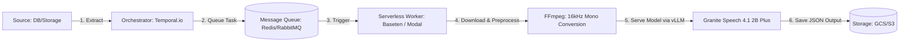

# Audio Transcription Pipeline Architecture

This document outlines the selected technology stack, model, and hosting strategy for building a highly scalable, cost-effective batch audio transcription pipeline with native speaker identification.

---

## 1. Selected Model: **IBM Granite Speech 4.1 2B Plus**

For transcription tasks requiring speaker separation, we have selected **`ibm-granite/granite-speech-4.1-2b-plus`**.

### Why this model?
*   **Native Speaker Attribution:** Traditional pipelines require running ASR (Whisper) and a separate clustering model (PyAnnote), then aligning their timestamps. The Granite "Plus" model performs **Speaker-Attributed ASR (SAA)** natively in a single forward pass, outputting formatted speaker tags (e.g., `[Speaker 1]`, `[Speaker 2]`) directly in the text stream.
*   **State-of-the-Art Accuracy:** Released in April 2026, it uses a modality-aligned speech-LLM architecture that outperforms traditional models on English benchmarks, leveraging semantic context to improve speaker attribution.
*   **Highly Compact:** At 2 Billion parameters, it is small enough to serve efficiently on cost-effective, mid-range GPUs without sacrificing enterprise-grade accuracy.

---

## 2. Recommended Batch Pipeline Architecture

For a system designed to **extract files and send them to models to transcribe**, an asynchronous batch pipeline is the most resilient and cost-effective pattern.

### Core Stack Components
1.  **Orchestrator (Temporal.io):** Manages file extraction, handles transient network retries during large file downloads, and ensures state persistence if workers crash mid-transcription.
2.  **Preprocessing (FFmpeg):** Packaged directly inside the worker container to automatically extract audio tracks from video and resample inputs to 16kHz mono before serving.
3.  **Inference Server (vLLM):** Serves the Granite 2B model, exposing an OpenAI-compatible endpoint (`/v1/audio/transcriptions`) and utilizing Continuous Batching to maximize GPU throughput.
4.  **Durable Storage (GCS/S3):** Holds raw source media and stores final structured JSON transcripts.

---

## 3. Comparison of Hosting Platforms for Granite 2B Plus

To host the model with a **scale-to-zero** capability (paying $0 when inactive), we evaluated three primary platforms:

| Feature | Replicate | Baseten (via Truss) | Hugging Face Endpoints |
| :--- | :--- | :--- | :--- |
| **Deployment Effort** | **Medium-High** (Requires manual Cog container packaging) | **Medium** (Simple YAML Truss configuration) | **Zero** (One-click GUI deploy from Hub) |
| **Cold Start Latency** | Fast (~5–15s for custom models) | **Fast (~10–15s on L4 GPUs)** | Slow (~1–3m due to fresh VM/download) |
| **Cost Structure** | Pay-per-millisecond of active processing | Pay-per-second of active processing | Hourly rate for dedicated GPU when active |
| **Customizability** | Medium (Can pack FFmpeg in Cog) | **Highest (Full container/handler control)** | Low (Uses standard HF ASR container) |

---

## 4. Final Hosting Recommendation

For a production-grade pipeline, **Baseten** (or **Modal**) is the recommended hosting platform.

### Rationale:
1.  **Optimal Hardware (NVIDIA L4):** You can deploy specifically to an **NVIDIA L4 GPU (24GB VRAM)**. Widespread in 2026, the L4 is extremely cheap (~$0.50–$0.60/hr), supports FP8 execution, and has plenty of VRAM to hold Granite's 2B weights (~4GB) while leaving a massive 20GB buffer for the long audio token KV cache.
2.  **FFmpeg Integration:** Baseten (via Truss) allows you to natively install `ffmpeg` as a system package in the container. Your endpoint can accept raw video/audio files, preprocess them, and feed them to the model in a single, secure transaction.
3.  **Fast Cold Starts:** Baseten aggressively caches weights, meaning when your pipeline wakes up from zero, it is ready to transcribe in ~10 seconds, compared to Hugging Face's minutes-long cold start.
