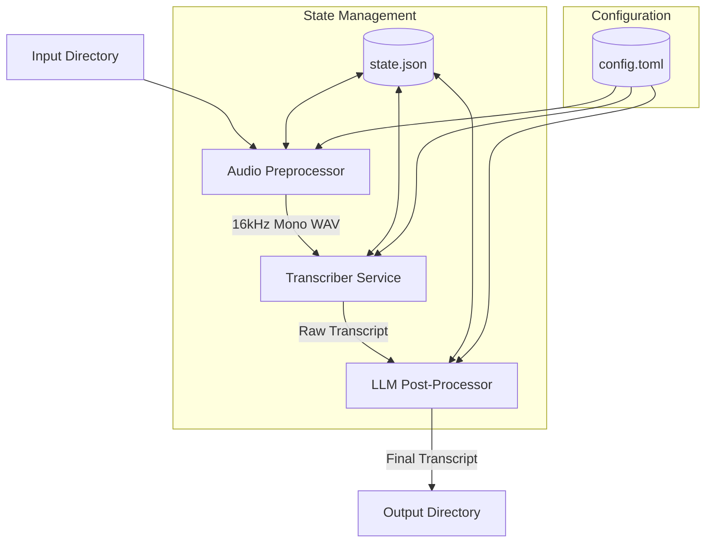

# Design Document: Flexible Audio Transcription & Post-Processing Pipeline

This document outlines the design for a Python-based audio transcription and post-processing pipeline. The system is designed to be modular, allowing easy swapping of transcription hosts and text LLM providers.

---

## 1. System Architecture

The pipeline processes audio files from an input directory, transcribes them using a configured ASR service (defaulting to IBM Granite Speech 4.1 2B Plus on Hugging Face for prototyping), and post-processes the transcripts using a text LLM (e.g., Gemini) with a customizable prompt.



---

## 2. Core Components

### 2.1. Configuration (`config.toml`)
A central TOML file configures all aspects of the pipeline:
-   Paths (input, output, prompt file).
-   Audio preprocessing settings.
-   Transcription settings (provider, endpoint, model, API key).
-   Post-processing settings (provider, endpoint, model, API key, temperature).

### 2.2. State Manager (`StateManager`)
To support resuming interrupted runs and avoiding duplicate work, a `state.json` file is maintained in the output directory.
-   Tracks file path, MD5 hash, transcription status, post-processing status, and timestamps.
-   Files are only processed if they are new or their hash has changed.

### 2.3. Audio Preprocessor (`AudioPreprocessor`)
Ensures audio files are in the optimal format for the transcription model.
-   Uses system `ffmpeg` via `subprocess` to convert input audio (MP3, M4A, WAV, etc.) to **16kHz mono WAV**.
-   Handles errors gracefully if `ffmpeg` is not installed (with an option to skip preprocessing).

### 2.4. Transcription Client (`BaseTranscriber`)
An abstract base class defining the interface for transcription services.
-   `transcribe(file_path: str) -> str`
-   **Implementations:**
    -   `HuggingFaceTranscriber`: Supports both Dedicated Endpoints and the free Inference API.
    -   `OpenAICompatibleTranscriber`: Supports Baseten, Modal, Replicate, or local vLLM instances exposing OpenAI ASR specs.

### 2.5. Post-Processor Client (`BasePostProcessor`)
An abstract base class defining the interface for text LLM services.
-   `post_process(transcript: str, prompt_template: str) -> str`
-   **Implementations:**
    -   `GeminiPostProcessor`: Uses the official `google-genai` SDK.
    -   `OpenAICompatiblePostProcessor`: Uses `openai` SDK for OpenAI, OpenRouter (highly recommended for swappable models), Anthropic (via compatibility layers), or other hosted services.

---

## 3. Configuration Schema (`config.toml`)

```toml
[paths]
input_dir = "input"
output_dir = "output"
prompt_file = "prompts/post_process.md"

[preprocessing]
enabled = true
ffmpeg_path = "ffmpeg" # Path to executable, or "ffmpeg" if in PATH

[transcriber]
# Options: "huggingface", "openai_compatible"
provider = "huggingface"
endpoint_url = "https://api-inference.huggingface.co/models/ibm-granite/granite-speech-4.1-2b-plus"
model = "ibm-granite/granite-speech-4.1-2b-plus"
api_key_env = "HF_API_KEY" # Name of env var holding the key

[post_processor]
# Options: "gemini", "openai_compatible"
provider = "gemini"
model = "gemini-2.5-flash"
api_key_env = "GEMINI_API_KEY"
temperature = 0.2
```

---

## 4. Data Flow

1.  **Initialization:** Load `config.toml`, initialize `StateManager`, and load the post-processing prompt from `prompt_file`.
2.  **Discovery:** Scan `input_dir` for supported audio files.
3.  **Filtering:** For each file, check `state.json`. Skip if already fully processed and hash matches.
4.  **Preprocessing:** Convert to 16kHz mono WAV (if enabled). Update state to "preprocessed".
5.  **Transcription:** Send audio to the configured `Transcriber`. Update state to "transcribed" and save intermediate raw transcript.
6.  **Post-Processing:** Send raw transcript + prompt to `PostProcessor`. Update state to "completed".
7.  **Output:** Save the final post-processed transcript to `output_dir` (e.g., `[filename]_final.md`).
