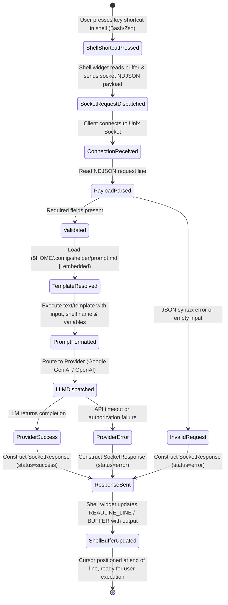

# Data Model: Background LLM Processing Service

## Entities & Data Structures

### 1. SocketRequest (Input Payload)

Represents an incoming client request sent over the Unix domain socket.

| Field | Type | Required | Description | Validation / Default |
|-------|------|----------|-------------|----------------------|
| `id` | `string` | No | Client-provided correlation ID | Auto-generated UUID if omitted |
| `provider` | `string` | No | LLM provider name (`google`, `openai`) | Default: `google` |
| `model` | `string` | No | Target LLM model name | Default per provider (`gemini-2.5-flash` / `gpt-4o`) |
| `input` | `string` | Yes | Raw user prompt or input text | Must not be empty |
| `template` | `string` | No | Inline prompt template string override | Valid `text/template` syntax if provided |
| `variables` | `map[string]string` | No | Custom key-value map for prompt templates | e.g. `{"shell": "bash"}` or `{"shell": "zsh"}` |
| `temperature` | `float64` | No | Sampling temperature (0.0 to 2.0) | Provider default if omitted |

---

### 2. SocketResponse (Output Payload)

Represents the response payload returned to the client over the socket connection.

| Field | Type | Required | Description |
|-------|------|----------|-------------|
| `id` | `string` | Yes | Matches `id` from `SocketRequest` |
| `status` | `string` | Yes | `success` or `error` |
| `output` | `string` | Yes (on success) | Text output generated by the LLM |
| `error` | `ResponseError` | Yes (on error) | Structured error object detailing failure |
| `metadata` | `ResponseMetadata` | Yes | Execution statistics and provider details |

#### ResponseError Sub-struct

```json
{
  "code": "INVALID_REQUEST | PROVIDER_ERROR | TEMPLATE_ERROR | SYSTEM_ERROR",
  "message": "Human-readable description",
  "details": "Actionable guidance or failure context"
}
```

#### ResponseMetadata Sub-struct

```json
{
  "provider": "google",
  "model": "gemini-2.5-flash",
  "latency_ms": 342,
  "template_source": "custom_file"
}
```

---

### 3. PromptTemplate

Internal domain entity representing the resolved template.

| Field | Type | Description |
|-------|------|-------------|
| `Source` | `TemplateSource` | Origin of template (`inline_override`, `user_config`, `bundled`) |
| `RawContent` | `string` | Raw template string containing Go `text/template` placeholders |
| `Compiled` | `*template.Template` | Parsed executable template |

---

### 4. ShellWidget Integration Entity

Represents the client-side interactive shell line editor hook.

| Component | Bash Implementation | Zsh Implementation |
|-----------|----------------------|--------------------|
| **Line Buffer Variable** | `READLINE_LINE` | `BUFFER` |
| **Cursor Position Variable** | `READLINE_POINT` | `CURSOR` |
| **Key Binding Mechanism** | `bind -x '"\C-xe": _shelper_widget'` | `zle -N _shelper_widget && bindkey '^X^E' _shelper_widget` |
| **Shell Context Variable** | `variables.shell = "bash"` | `variables.shell = "zsh"` |

---

### 5. DaemonConfig

Service runtime configuration loaded on startup.

| Field | Type | Default Value Resolution |
|-------|------|--------------------------|
| `SocketPath` | `string` | 1. `$SHELPER_SOCK`<br>2. `${XDG_RUNTIME_DIR}/shelper.sock`<br>3. `${TMPDIR}/shelper.${UID}.sock` |
| `CustomPromptPath` | `string` | `$HOME/.config/shelper/prompt.md` |
| `DefaultProvider` | `string` | `google` |
| `MaxWorkers` | `int` | `20` |

---

## State Machine / Request Lifecycle


