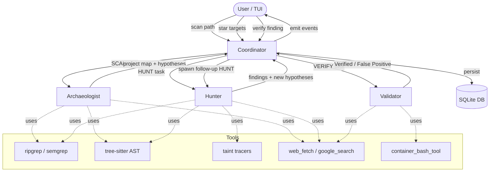

# 💎 TrashDig: AI-Powered Vulnerability Research Assistant

TrashDig is a multi-agent, language-agnostic vulnerability scanner and security research assistant. It uses LLMs (like Gemini) to map complex project structures, trace data flows, and automatically identify security vulnerabilities that traditional tools often miss.

---

## 🚀 Key Features

*   **Multi-Agent Intelligence**: Built on the Google Agent Development Kit (ADK), featuring specialized agents:
    *   **Archaeologist**: Maps project structure and detects high-value targets (entry points, sensitive configs).
    *   **Hunter**: Performs autonomous, hypothesis-driven depth-first analysis on prioritized files.
    *   **Validator**: Attempts to generate Proof-of-Concept (PoC) code to verify findings.
*   **Human-in-the-Loop TUI**: A beautiful terminal interface (built with `Textual`) for reviewing maps, starring high-interest areas, and steering the "Hunt."
*   **Persistent Intelligence**: Uses a SQLite-backed **ProjectDatabase** to store project profiles, symbols, findings, and a full interaction history, allowing you to resume research across multiple sessions.
*   **Enhanced Taint Analysis**: Goes beyond single-file grep. Uses **cross-file data flow tracing** and **AST-aware parsing** to track untrusted user input to dangerous sinks across module boundaries.
*   **Language Agnostic**: Uses `tree-sitter` and `semgrep` to understand and trace patterns across any codebase (Python, JavaScript, Go, C#, and more).
*   **Automated Findings**: Generates detailed Markdown reports for each vulnerability in a `findings/` directory.

---

## 🤖 Agent Architecture

TrashDig uses a pipeline of three specialized LLM agents, orchestrated by a central **Coordinator**. Each agent has a distinct role and a curated toolset.

### Coordinator

The Coordinator is the backbone of the system. It maintains a task queue and drives the **Observe → Hypothesize → Verify** loop, dispatching work to the appropriate agent based on task type (`SCAN`, `HUNT`, `VERIFY`). It also persists all findings and hypotheses to a SQLite database and surfaces events to the TUI in real time.

### Archaeologist

> *"Map the terrain before you dig."*

The Archaeologist is the first agent to run. Given a project root, it:

1. Walks the directory tree (respecting `.gitignore`) and builds a complete file inventory.
2. Detects the tech stack by reading dependency manifests (`package.json`, `pyproject.toml`, `go.mod`, etc.) and cross-referencing known framework signatures.
3. Assigns each file a one-sentence summary and an `is_high_value` flag, prioritizing files likely to contain security-sensitive logic: route handlers, auth modules, database access layers, and configuration files.
4. Emits **hypotheses** — structured follow-up targets — that the Coordinator queues as `HUNT` tasks.

**Tools**: `ripgrep_search`, `get_ast_summary`, `query_cwe_database`, `find_references`, `get_scope_info`, `web_fetch`, `google_search`

### Hunter

> *"Follow every thread, cross every boundary."*

The Hunter performs deep-dive vulnerability analysis on the targets surfaced by the Archaeologist (or manually starred by the user). For each target it:

1. Runs `semgrep_scan` for known-bad patterns and OWASP rule sets.
2. Performs **taint analysis**: identifies user-controlled *sources* (e.g., `request.args`, `os.environ`) and traces them toward dangerous *sinks* (e.g., `db.execute`, `eval`, `os.system`).
3. Crosses file boundaries using `get_symbol_definition` and `find_references` rather than stopping at the edge of a file.
4. If a data flow disappears into an unanalyzed file, it emits a new **hypothesis** for that file, creating a recursive hunt loop.
5. Documents each confirmed finding with title, description, severity, CWE ID, exploitation path, and remediation advice.

**Tools**: `ripgrep_search`, `semgrep_scan`, `get_ast_summary`, `query_cwe_database`, `get_symbol_definition`, `trace_variable`, `find_references`, `get_scope_info`, `trace_variable_semantic`, `trace_taint_cross_file`, `web_fetch`, `google_search`

### Validator

> *"Proof, not conjecture."*

The Validator takes a finding from the Hunter and attempts to produce empirical evidence that it is exploitable. It:

1. Reviews the vulnerable code and the Hunter's description to formulate a specific test hypothesis (e.g., *"a single quote in the `id` parameter triggers a SQL syntax error"*).
2. Generates a standalone PoC — a Python script, `curl` command, or small test case.
3. Executes the PoC inside an **isolated Docker container** via `container_bash_tool`, keeping the host environment safe.
4. Analyses exit codes, stdout, and stderr to determine whether the behavior matches the expected "vulnerable" output.
5. Iterates if the PoC has environmental errors (missing dependencies, wrong port), then returns a verdict: **Verified** or **False Positive**.

**Tools**: `container_bash_tool`, `bash_tool`, `ripgrep_search`, `read_file_content`, `web_fetch`, `google_search`

### Agent Relationship Diagram



---

## 🏁 Getting Started

### Prerequisites

*   [mise](https://mise.jdx.dev/) (for task orchestration and tool management)
*   [uv](https://github.com/astral-sh/uv) (for ultra-fast Python dependency management)
*   A Gemini API Key (or access to an LLM provider supported by ADK)

### Installation

1.  **Clone the repository**:
    ```bash
    git clone https://github.com/yourusername/trashdig.git
    cd trashdig
    ```

2.  **Install dependencies**:
    ```bash
    mise install  # Installs python and required tools
    uv sync       # Syncs the virtual environment
    ```

---

## ⚙️ Configuration

TrashDig is configured via `config.toml`. Create one in the root directory:

```toml
[ui]
interface = "textual"

[agents.archaeologist]
model = "gemini-2.0-flash"
provider = "google"

[agents.hunter]
model = "gemini-2.0-flash"
provider = "google"

[providers.google]
# API keys are best provided via environment variables (e.g., GOOGLE_API_KEY)
```

---

## 🛠 Usage

1.  **Launch the TUI**:
    ```bash
    mise run run
    ```
    *(Alternatively: `uv run python src/trashdig/main.py`)*

2.  **Scan**: The Archaeologist will automatically begin mapping the current directory.
3.  **Prioritize**: Use the TUI to review the project map. Use the `Space` or `S` keys to "Star" files or directories that look suspicious (e.g., controllers, routes, auth logic).
4.  **Hunt**: Once prioritized, trigger the "Hunt" mode. The Hunter agent will begin an autonomous loop to find vulnerabilities in the starred targets.

---

## 📜 Development & Contribution

We use `mise` for common developer tasks:

*   **Run Tests**: `mise run test`
*   **Linting**: `mise run lint`
*   **Format**: `mise run format`
*   **Coverage**: `mise run coverage`

### Engineering Standards
Please refer to [AGENTS.md](./AGENTS.md) for architectural details and contribution rules.

---

## 🛡 Security Disclaimer

TrashDig is a security research tool. It is designed to find vulnerabilities in code you own or have explicit permission to test. **Never use this tool on unauthorized targets.** The authors are not responsible for any misuse or damage caused by this tool.

---

## 📝 License

Apache 2.0. See [LICENSE](LICENSE) for details.
