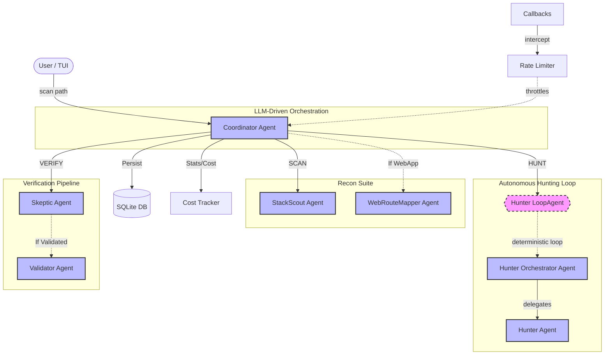

# 💎 TrashDig: AI-Powered Vulnerability Research Assistant

TrashDig is a multi-agent, language-agnostic vulnerability scanner and security research assistant. It uses LLMs (like Gemini) to map complex project structures, trace data flows, and automatically identify security vulnerabilities that traditional tools often miss.

---

## 🚀 Key Features

*   **Multi-Agent Intelligence**: Built on the Google Agent Development Kit (ADK), featuring specialized agents:
    *   **StackScout**: Hybrid environment detection (deterministic + LLM inference).
    *   **WebRouteMapper**: Deep attack surface mapping for web applications.
    *   **Hunter**: Autonomous, hypothesis-driven depth-first analysis with cross-file taint tracing.
    *   **Skeptic**: Adversarial reviewer that critiques findings to reduce false positives.
    *   **Validator**: Containerized Proof-of-Concept (PoC) generation and verification.
*   **Context Compaction**: Automated history pruning and summarization to handle long-running research sessions without exceeding model token limits.
*   **Parallel Execution**: Asynchronous task processing with a worker-pool pattern to scan projects faster.
*   **Safety Middleware**: Logic-level permission management and tool sandboxing (Docker/Minijail).
*   **Persistent Intelligence**: SQLite-backed **ProjectDatabase** for findings, symbols, and session persistence.

---

## 🤖 Agent Architecture

TrashDig uses a pipeline of specialized agents coordinated by a central **Coordinator**.

### Recon Suite
*   **StackScout**: Builds a project profile by combining file-signature detection with LLM analysis.
*   **WebRouteMapper**: (Conditional) Deep-dives into entry points if a web stack is detected.

### Hunter
Performs deep-dive analysis on prioritized targets. It uses **semgrep** for patterns and **tree-sitter** for semantic taint analysis, following data flows across module boundaries until it identifies a vulnerable sink.

### Verification Pipeline
*   **Skeptic**: Acts as a "Socratic Debunker," attempting to find logic flaws or mitigations in the Hunter's findings.
*   **Validator**: For findings that survive the Skeptic, it generates a Python/Bash PoC and executes it in an isolated **Docker** container to prove exploitability.

### Agent Relationship Diagram



---

## 🛠 Agent Toolset

TrashDig agents have access to a suite of deterministic and research-oriented tools to perform their tasks.

| Category | Tool Name | Description | Used By |
| :--- | :--- | :--- | :--- |
| **Recon & Search** | `get_project_structure` | Lists all relevant files in the workspace. | SS, WRM |
| | `detect_frameworks` | Identifies web frameworks, databases, and libraries. | SS |
| | `list_files` | Lists directory contents with sizes and dates. | All Agents |
| | `find_files` | Finds files by name pattern. | All Agents |
| | `detect_language` | Detects programming language for files/projects. | SS, H |
| | `ripgrep_search` | High-speed textual search across the codebase. | All Agents |
| | `google_search` | Searches the web for security advisories or tech info. | SS, H, S, V |
| | `web_fetch` | Downloads and parses web pages for research. | All Agents |
| **Code Analysis** | `get_ast_summary` | Generates a simplified AST of a file (tree-sitter). | SS, WRM, H |
| | `get_symbol_definition` | Finds the source definition of a class or function. | H |
| | `find_references` | Finds all usages of a specific symbol. | SS, H |
| | `get_scope_info` | Extracts local variables and parameters for a line. | SS, H |
| | `read_file` | Reads the full content of a file. | H, S, V |
| | `semgrep_scan` | Pattern-based security scanning. | H |
| **Data Flow** | `trace_variable` | Traces a variable's usage within a file. | H |
| | `trace_variable_semantic`| AST-aware intra-file taint tracing. | H |
| | `trace_taint_cross_file`| Follows untrusted data across module boundaries. | H |
| **Execution** | `bash_tool` | Executes shell commands in a local sandbox. | V |
| | `container_bash_tool` | Executes commands in an isolated Docker container. | V |
| **Orchestration** | `get_next_hypothesis` | Retrieves the next prioritized hunting target. | HO |
| | `save_findings` | Persists discovered vulnerabilities to the database. | HO |
| | `exit_loop` | Deterministically ends the autonomous hunting loop. | HO |
| **Knowledge** | `query_cwe_database` | Queries CWE definitions and vulnerability examples. | SS, H |

> **Key**: **SS**: StackScout, **WRM**: WebRouteMapper, **H**: Hunter, **HO**: HunterOrchestrator, **S**: Skeptic, **V**: Validator

---

## 🏁 Getting Started

### Prerequisites

*   Python 3.14+
*   [mise](https://mise.jdx.dev/)
*   [uv](https://github.com/astral-sh/uv)
*   A Gemini API Key (set via `GOOGLE_API_KEY` or in `trashdig.toml` under `[providers.google]`)
*   Docker (required for the `ValidatorAgent` PoC sandbox)

### Installation & Usage

1.  **Sync Environment**: `uv sync`
2.  **Launch TUI**: `uv run trashdig [DIR]` or `mise run run`
3.  **Run Tests**: `mise run test`
4.  **Full Validation** (lint + type check + tests): `mise run check`

### Alternate LLM Provider

TrashDig also supports [OpenRouter](https://openrouter.ai/) as an LLM backend. Configure it in `trashdig.toml`:

```toml
provider = "openrouter"

[providers.openrouter]
api_key = "YOUR_OPENROUTER_API_KEY"
base_url = "https://openrouter.ai/api/v1"
```

### Supported Languages

Tree-sitter AST analysis is supported for: **Python**, **JavaScript/TypeScript**, **Go**, and **C#**.

---

## 📜 Development

Refer to [AGENTS.md](./AGENTS.md) for the full architectural mandate and contribution guidelines.

---

## 🛡 Security Disclaimer

TrashDig is for authorized security research only. Authors are not responsible for misuse.

---

## 📝 License

Apache 2.0.
