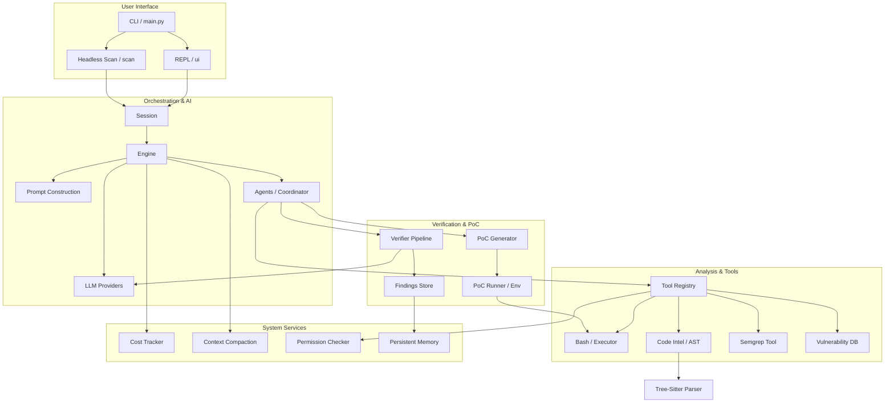

# SleepyBear Architecture

SleepyBear is an agentic vulnerability research platform. It uses Large Language Models (LLMs) to analyze codebases, identify security flaws, and generate Proof-of-Concept (PoC) exploits.

## Component Overview

### Core Orchestration
- **`main.py` & `session.py`**: Entry point and global state management. Coordinates the transition between interactive REPL and headless scanning.
- **`engine/`**: The core execution loop. Implements a state machine for LLM interactions, handling tool calls, message history, and context window management.
- **`providers/`**: Multi-provider LLM abstraction (Gemini, Claude, Vertex AI).
- **`prompt/`**: Advanced prompt engineering system. Managed system instructions and project context.

### Agents & Specialized Logic
- **`agents/`**: High-level AI personas.
    - `Coordinator`: Orchestrates the overall research process.
    - `Recon`: Performs initial project discovery.
    - `ProjectAnalyzer`: Maps attack surfaces and entry points.
- **`verifier/`**: Validation layer to reduce false positives using deterministic checks and adversarial LLM analysis.
- **`poc/`**: Automated exploitation engine. Handles environment setup and execution of generated PoC scripts.

### Analysis Tools
- **`tools/`**: Extensible toolset for agents (Bash, File I/O, Semgrep, VulnDB).
- **`code_intel/`**: AST-aware code navigation using `tree-sitter`. Provides "Go to Definition" and usage tracking.
- **`scan/`**: High-level pipeline management for the entire vulnerability research lifecycle.

### Infrastructure & UI
- **`services/`**: Shared services like cost tracking, history management, and retry logic.
- **`ui/` & `display/`**: Rich terminal interface (REPL) and status rendering using `rich` and `prompt-toolkit`.
- **`permissions/`**: Security middleware that validates agent actions against user-defined policies.
- **`memory/`**: Persistent storage for long-term agent state and project findings.

## Component Connections

The following diagram illustrates the high-level flow and connections between SleepyBear's primary components.

## Data Flow Summary
1. **Input**: User provides a target directory via CLI or REPL.
2. **Analysis**: `Recon` and `ProjectAnalyzer` agents use `Code Intel` and `Grep` tools to map the project.
3. **Hypothesis**: The `Coordinator` agent forms vulnerability hypotheses and spawns specialist tasks.
4. **Execution**: Agents use `Bash`, `Semgrep`, and `FileRead` tools to investigate code paths.
5. **Verification**: Findings are sent to the `Verifier` to confirm validity.
6. **Exploitation**: The `PoC` system attempts to generate and run a script that proves the vulnerability.
7. **Reporting**: Final findings are persisted to the `Findings Store` and rendered to the user.
