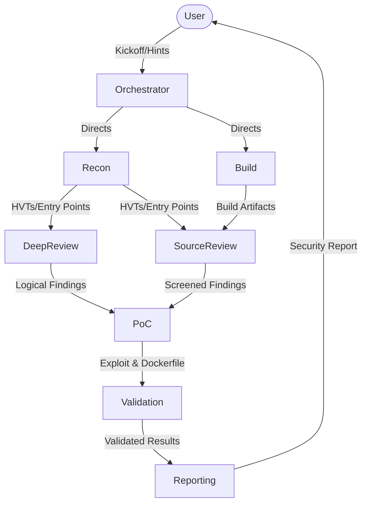

# VPOC

VPOC is an autonomous security analysis tool for Application Security, built on the Google Agent Development Kit (ADK).

It focuses on source-available security analysis, combining LLM-driven vulnerability discovery with automated Proof-of-Concept (PoC) validation.

## Architecture

VPOC employs a multi-agent orchestration pattern built on the **Google Agent Development Kit (ADK)**. It leverages **ADK Workflow Agents** (e.g., `SequentialAgent`, `ParallelAgent`) to manage the analysis pipeline, where each agent combines **deterministic tool-driven logic** with **LLM-driven reasoning**.

### Agent Roles

- **Orchestrator Agent**: An **ADK SequentialAgent** that acts as the central controller. It manages the project lifecycle by coordinating specialized sub-agents, enforcing budgets, and interpreting user hints to adjust strategy.
- **Attack Surface Mapper (Recon Agent)**: A **BaseAgent** that maps entry points by analyzing routing files and configurations. It identifies high-value targets (HVTs) for focused analysis.
- **Environment Architect (Build Agent)**: A **BaseAgent** that automates the setup of the target application's build environment, resolving dependencies and interpreting compiler errors.
- **Source Review Agent**: A **ParallelAgent** that orchestrates a suite of static analysis tools. It uses LLM reasoning to pre-screen findings and prioritize vulnerabilities.
- **Deep LLM Review Agent**: An **LlmAgent** that performs meticulous security audits of HVTs, focusing on complex logical flaws missed by automated tools.
- **PoC Agent**: An **LlmAgent** that dynamically generates proof-of-concept (PoC) exploit scripts and Docker environments.
- **Validation Agent**: A **BaseAgent** that executes PoCs within a hardened, isolated sandbox and analyzes results.
- **Reporting Agent**: An **LlmAgent** that synthesizes findings and logs into a comprehensive security report.

### Workflow

## Features

- **Multi-Language Support**: PHP, C/C++, Go, Rust, Lua.
- **Autonomous Validation**: 
  - Findings are validated by running the application in a **hardened Docker sandbox** (using gVisor/seccomp, strict resource limits, and no-egress networking).
  - **Pipelined Analysis**: Findings are streamed from discovery to validation in real-time, using a priority-weighted queue.
  - **Hybrid Environment**: Uses pre-configured base containers specialized at runtime based on source analysis.
- **Interactive Human-in-the-Loop**:
  - **TUI Mode**: Terminal User Interface for single-project analysis, featuring dedicated screens for Chat, Status, and Findings.
  - **Web Dashboard**: Web-based interface for real-time monitoring and multi-project triage.
  - **Project Initialization Wizard**: Kickoff reviews with high-level descriptions, git URLs, or file uploads.
  - **Human Guidance**: Users can provide hints, approve/reject findings, and define strategic priorities.
- **State Persistence & Resumption**:
  - **Checkpointing**: All runs record granular state to allow stopping and resuming without significant loss of analysis quality.
  - **Project Isolation**: Each project maintains its own isolated state and findings database.
- **Resource Management**:
  - **Deterministic Budgeting**: Hard daily budget caps enforced across all projects.
  - **Per-Agent Model Assignment**: Optimize cost and performance by assigning specific models (e.g., Gemini 1.5 Pro vs. Flash) to different agents.

## Supported AI Platforms

- VertexAI
- OpenRouter
- Any OpenAI-Compatible

## Feedback

- Provide a log of the full LLM conversations in the findings.
- Generate a clear report of the finding for human review.

## Author

- David Tomaschik <matir@pm.me>

With assistance from Claude and Gemini. :)
