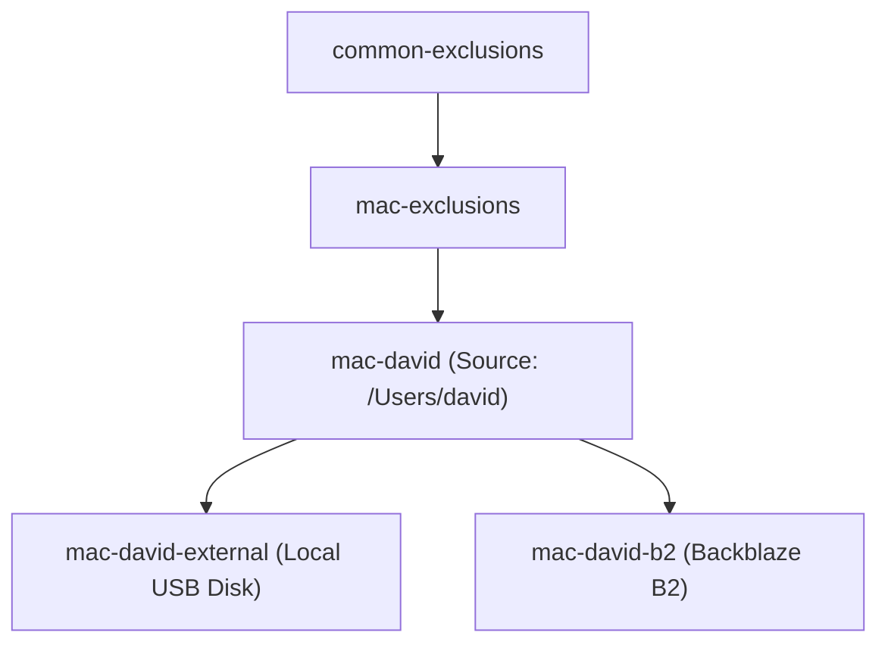

# Resticprofile Backup Configuration

This repository contains a modular [resticprofile](https://creativeprojects.github.io/resticprofile/) configuration written in TOML ([profiles.toml](file:///usr/local/google/home/davidtomaschik/Personal/hacks/backups/profiles.toml)) designed to manage macOS backups across multiple destinations.

---

## Profile Inheritance Hierarchy



---

## Profiles Summary

| Profile | Purpose | Inherits From | Key Settings |
| :--- | :--- | :--- | :--- |
| **`common-exclusions`** | Base exclusion rules | *None* | Excludes `.tmp`, `.lock`, `.bak`, and temporary files via Go templates. |
| **`mac-exclusions`** | macOS system exclusions | `common-exclusions` | Excludes system Caches, Logs, `.Trash`, `.DS_Store`, Spotlight, etc. |
| **`mac-david`** | Primary User Backup | `mac-exclusions` | Selects `/Users/david` as source; adds custom exclusions (`Downloads`, `VirtualMachines`). |
| **`mac-david-external`** | Local External Drive Backup | `mac-david` | Pre-checks mount status via `diskutil`; targets `/Volumes/ExternalBackup/restic-repo`. |
| **`mac-david-b2`** | Offsite Cloud Backup | `mac-david` | Targets `b2:my-b2-bucket:/mac-david`; sources API keys from `key/b2_creds.env`. |

---

## Usage

### Running Backups

To run a backup to your external hard drive:
```bash
resticprofile --profile mac-david-external backup
```

To run an offsite backup to Backblaze B2:
```bash
resticprofile --profile mac-david-b2 backup
```

### Credentials & Environment Files

When targeting Backblaze B2 (`mac-david-b2`), ensure the following credentials files exist:

1. **`key/b2_password.txt`**: The restic repository encryption key.
2. **`key/b2_creds.env`**: B2 API credentials loaded automatically via `env-file`:
   ```env
   B2_ACCOUNT_ID=your_key_id
   B2_ACCOUNT_KEY=your_application_key
   ```
